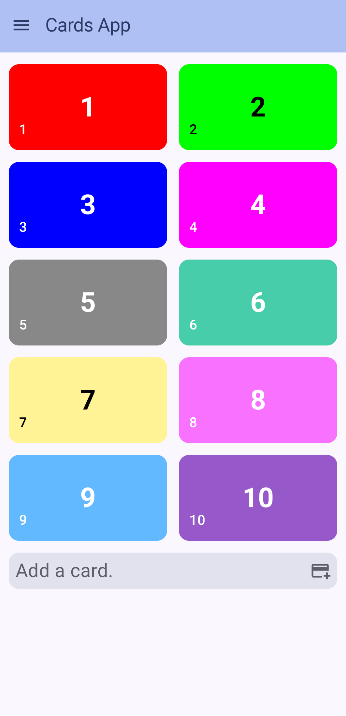
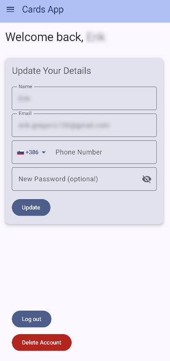
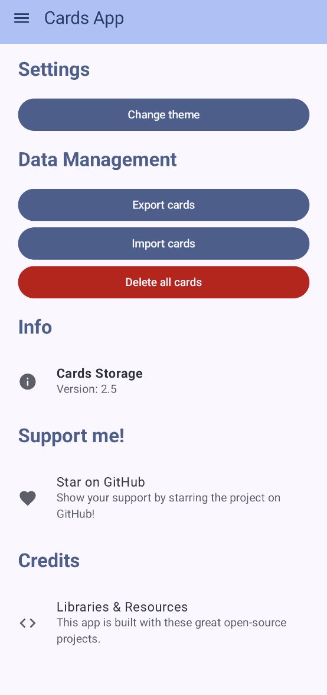

# Cards Storage

A simple, modern Android application built with Jetpack Compose for securely storing and managing your personal cards, such as loyalty cards, library cards, and membership cards.

## 📸 Screenshots

| Main Screen (Home)                            | Card Detail / Barcode View                   | Add/Edit Card Screen                          |
| --------------------------------------------- | -------------------------------------------- | --------------------------------------------- |
|  |  |  |

| Account Screen                                | Settings Screen                              |
| --------------------------------------------- | -------------------------------------------- |
|  |  |

## ✨ Features

*   **Modern UI:** Built entirely with Jetpack Compose and Material 3 design.
*   **Card Management:** Add, view, edit, and delete your cards.
*   **Barcode Support:** Generate and display barcodes (QR Code, Code 128, etc.) for easy scanning.
*   **Reorderable List:** Drag and drop to organize your cards just the way you like.
*   **Dynamic Theming:** Choose between Light, Dark, and System default themes.
*   **Local Storage:** All data is stored securely on your device using Jetpack DataStore.

## 🛠️ Built With

This project showcases modern Android development practices and utilizes a number of popular libraries:

*   **[Jetpack Compose](https://developer.android.com/jetpack/compose):** The modern toolkit for building native Android UI.
*   **[Kotlin Coroutines](https://kotlinlang.org/docs/coroutines-overview.html):** For asynchronous and non-blocking programming.
*   **[Material 3](https://m3.material.io/):** The latest version of Google's open-source design system.
*   **[Jetpack DataStore](https://developer.android.com/topic/libraries/architecture/datastore):** For securely storing simple key-value data (like user settings).
*   **[Coil](https://coil-kt.github.io/coil/):** An image loading library for Android backed by Kotlin Coroutines.
*   **[Retrofit & OkHttp](https://square.github.io/retrofit/):** For type-safe HTTP client and efficient networking.
*   **[ZXing (Zebra Crossing)](https://github.com/zxing/zxing):** For barcode image processing.
*   **[Kotlinx.serialization](https://github.com/Kotlin/kotlinx.serialization):** For serializing and deserializing data.
*   **[ColorPicker-Compose by skydoves](https://github.com/skydoves/colorpicker-compose):** A beautiful, feature-rich color picker.
*   **[Reorderable by Calvin Shroff](https://github.com/Calvin-LL/Reorderable):** A modifier for reorderable drag-and-drop lists.

## 🚀 Getting Started

To build and run the project, you'll need:
1.  Android Studio Iguana | 2023.2.1 or newer.
2.  An Android device or emulator running API level 26 or higher.

Simply clone the repository and open it in Android Studio:

bash git clone https://github.com/Enrico-100/cards-storage.git

## 🤝 Contributing

Contributions are welcome! If you find a bug or have a feature request, please open an issue. If you want to contribute code, please feel free to fork the repository and submit a pull request.

## 📄 License

This project is licensed under the Apache 2.0 License - see the [LICENSE](LICENSE) file for details.

## 🙏 Acknowledgments

This application would not have been possible without the vibrant open-source community. A huge thank you to the creators and maintainers of the fantastic libraries used in this project, especially:

*   **[Coil](https://coil-kt.github.io/coil/)** for seamless image loading.
*   **[ZXing (Zebra Crossing)](https://github.com/zxing/zxing)** for robust barcode processing.
*   **[ColorPicker-Compose by skydoves](https://github.com/skydoves/colorpicker-compose)** for the beautiful color picker.
*   **[Reorderable by Calvin Shroff](https://github.com/Calvin-LL/Reorderable)** for the intuitive drag-and-drop functionality.
*   **[Retrofit & OkHttp by Square](https://square.github.io/retrofit/)** for making networking a breeze.

Your work is invaluable and greatly appreciated!
